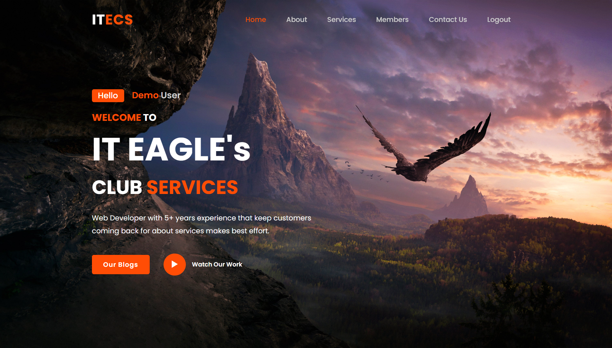
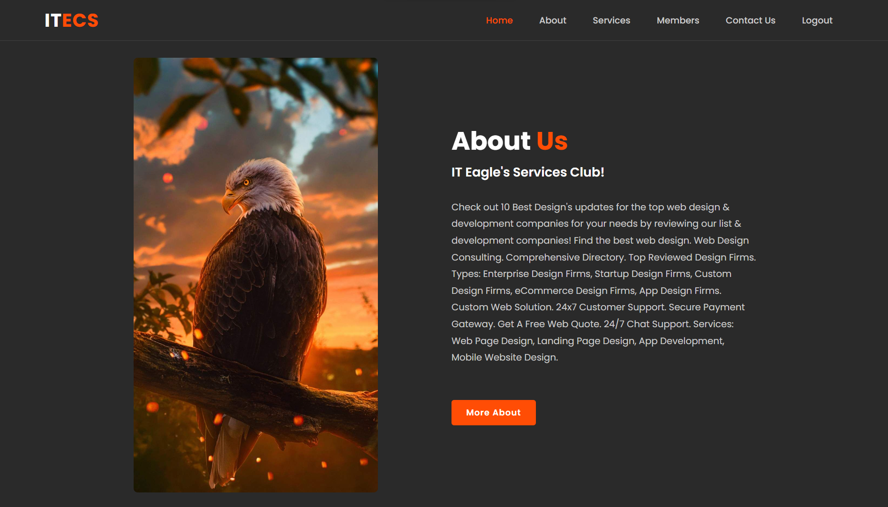
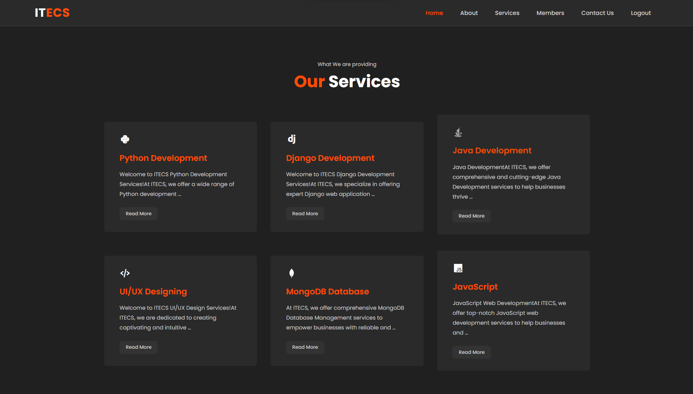
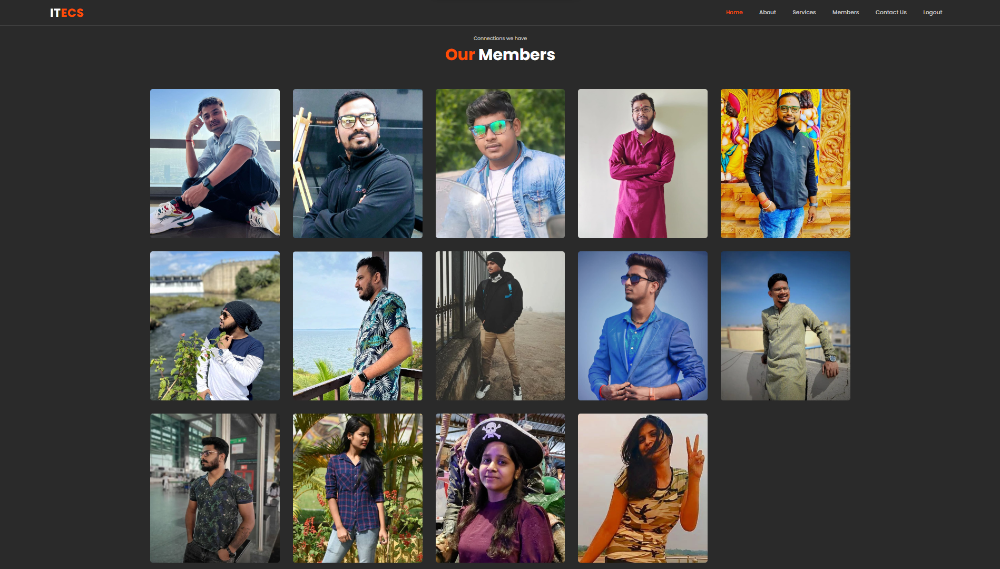
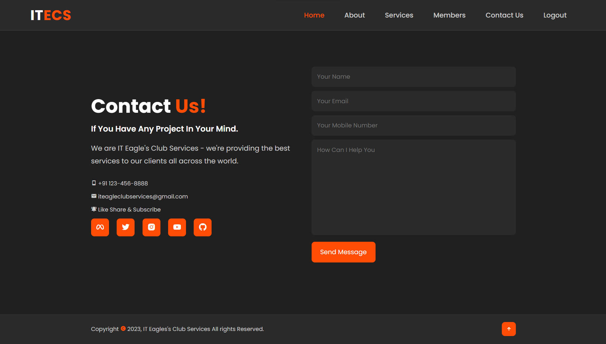

# IT Eagle's Club Services

## Table of Contents

* [Features](#features)
* [Installations](#installations)
* [Usage](#usage)
* [Authentication](#authentication)
* [Contributing](#contributing)
* [License](#license)
* [Website Images](#websiteimages)

### Features

* ITECS provides services like online courses on different topics (Web Development, Full Stack Development, Online Marketing, Digital Marketing, and etc.) and we also support social services (Tree Plantation Program, Blood Donation Camp, etc).
* Admin Handling lnterface and additional features to Admin like adding members, blog data, remove exclusive content and etc.
* Blog Page (User and Admin both can add blog on the website), where you can post your thoughts.
* User Authentication.
* Responsive UI/UX Design for all devices.
* Contact us using the email system provided in the website.

### Installations

1. Clone the repository:

   ```shell
   git clone https://github.com/study-soumya/IT-Eagle-Club-Services
   cd IT-Eagle-Club-Services
   ```
2. Make Virtual Environment:

   ```shell
   python -m venv env
   ```
3. Activate Environment:

   ```shell
   Windows: ./env/Scripts/activate
   Bash: source env/Scripts/activate
   ```
4. Install the required Python packages:

```shell
pip install -r requirements.txt
```

5. Configure the database settings in `ITECS/settings.py`.
6. Apply migrations:

   ```shell
   python manage.py makemigrations
   python manage.py migrate
   ```
7. Create a superuser for admin access:

   ```shell
   python manage.py createsuperuser
   ```
8. Run the development server:

   ```shell
   python manage.py runserver
   ```
9. Username & Password:

   ```shell
   usename: demo
   password: demosite
   ```

### Usage

#### Admin Access

1. Access the admin panel at `http://localhost:8000/admin/` and log in with the superuser credentials created in step 5 of the installation.
2. Use the admin panel to add informations on ITECS Members, ITECS Services, ITECS Blog and ITECS Work.

#### User Access

* User can access all the details that are provided in the website except modifying the information that are provided by the Admin User.
* User can login and post blogs, edit blogs, access to see the information regarding Services that we are providing.

### Authentication

* Users are authorized by Django's built-in User Authentication method.

### Contributing

Contributions to this project are welcome. If you'd like to make improvements, please follow these steps:

1. Fork the repository.
2. Create a new branch for your feature or bug fix.
3. Make your changes and submit a pull request.

Please ensure your code follows best practices and includes appropriate tests.

### License

This project is licensed under the MIT License - see the [LICENSE](LICENSE) file for details.

### Live Website: [IT Eagle&#39;s Club Services](https://sonusoum.pythonanywhere.com/)

### Website Images

Home Page:



About Section:



Services Section:



Members Section:



Contact Section:


